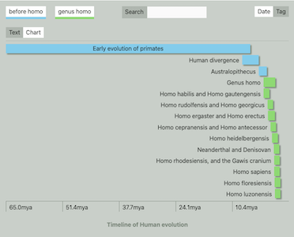

# Table Timeline

13th March 2024



## Introduction

Table timeline is a custom web component that takes an appropriately structured HTML table and converts it into a graphical timeline or prose, formatted with a custom stylesheet. Implementing the timeline as a table means that a timeline can be indexed without the javascript component being triggered which supports SEO.

An Excel workbook is also provided with sample timelines which can be used to generate of the required html automatically. A custom node script `excel-to-timeline` is provided for this purpose. This script relies on the NPM package `XLSX` which needs to be installed as follows:

```
$ npm install xlsx
```

Full details for other ways to install are provided here: https://www.npmjs.com/package/xlsx


## Installation

The source files are available here:

https://github.com/Wolsten/Table-Timeline.git

The main files you need are the javascript module `table-timeline.js` and the css file `table-timeline.css`.

Add the script tag to the `<head>` section, using the `defer` attribute:

`<script src="/table-timeline.js" defer></script>`

The url location of the style sheet should be set as an option using the data-css-url parameter in any included table-timeline element (see later). This means that you have the option of customising the stylesheet for each timeline.

### Installing as a Git Submodule

Issue the following command to install table-timeline in your website in a specific folder, such as `static/timeline` for example:

```
git submodule add https://github.com/Wolsten/Table-Timeline.git static/timeline
```

## Quick Start

To generate a number of sample timelines for testing run the following script:

```
$ node excel-to-timeline test=true
```

The full set of parameters are as follows:

| Parameter | Values | Description |
| --------- | ------ | ----------- |
| test | true or false | Default is `false`. When `false` only the actual timeline HTML is generated, and the resulting code can be included in other HTML pages or markdown (with suitable configuration). When set to `true` a full HTML file is generated which can be tested in a browser, e.g. using LiveServer. |
| input | string | The name of the excel workbook to use as the source of timelines. If not specified the example workbook `timelines.xlsm` is used. |
| dest | string | The full path for where to save the generated HTML files. If not specified the default is `./timelines`, i.e. a new folder within the build directory. |
| css-url | string | This should be a root relative url to where to find the table-timeline.css stylesheet. The default is "/" |
| images-url | string | This should be a root relative url to where to find any timeline or event header images. The default is "/" |
||||


## Adding Components Manually

It is also possible to write timelines manually in HTML.

A table timeline is identified by a `figure` element with the `is` attribute set to `table-timeline`. The default view can be set using the `data-view` attribute. By default the component assumes that the css file `table-timeline.css` is located in the same place as the component itself. This can be modified by setting your own url using the `data-css-url` parameter.

The component includes various inputs for filtering and sorting the events and these can be removed individually if required using a comma separated list of `attribute:value` pairs for the `data-controls` attribute as follows (default values given first in each case):

| Attribute | Value | Usage |
| --------- | ----- | ----- |
| search | `true` or `false` | Display search box? |
| view   | `true` or `false` | Display view switch toggle buttons |
| tags   | `true` or `false` | Display tag filter buttons |
| sorting | `true` or `false` | Display sorting options (date/tag) |
| test | `false` or `true` | If true any linked timeline links will include a `.html` suffix. |
||||

e.g. 
```
data-controls="sorting:false,test:true"
```

Additionally one may choose the default view to display:

```
data-view="chart or text"
```

If not specified the default view is `chart`.

Finally, the component will generate default colours for each event according to its tag. You can override this using the `data-tag-colours` attribute as follows:

```
data-tag-colours="fruit:#E49EDD,vegetable:#4D93D9,animal:#83CCEB"
```

The tag colours should be specified as hyphenated versions of the tag name. Therefore, the tag name `large animals` would be specified by `large-animals`.

You can specify your colours as any valid CSS colour value. The example workbook `timelines.xlsm` shows that you can set the colours (optionally) in each sheet. 

Simply insert two rows before the start of the events with the first called `tags` and the second called `colours` (note both must be lower case). In the tags row list the tags used in your events table (or at least the ones you want to override the colours for). Then below each tag in the colours row, set the background colour of the cell as required. When you save the workbook, a macro is run to insert matching Hex colour names into the coloured cells. See the two sheets `UK Prime Ministers` and `History of the Universe` for examples.

So an example table timeline would be structured as follows:

```html
<figure
    is="table-timeline"
    [data-view="chart"]
    [data-images-url="/images"]
    [data-css-url="/styles"]
    [data-controls="sorting:false,test:true"]
    [data-tag-colours="fruit:#E49EDD,vegetable:#4D93D9,animal:#83CCEB"]
>
    <table>
        <!-- Table head -->
        <thead>
            <tr>
                <th>event</th>
                <th>start</th>
                <th>end</th>
                <th>tag</th>
                <th>content</th>
                <th>citations</th>
                <th>link</th>
                <th>image</th>
            </tr>
        </thead>

        <tbody>
            <!-- First event row -->
            <tr>
                <th>event title</th>
                <th>event start data</th>
                <th>event end date</th>
                <th>event tag (the type of event)</th>
                <th>event content</th>
                <th>event citations</th>
                <th>event link - name of a linked timeline</th>
                <th>event image link</th>
            </tr>

            <tr>
                <!-- More event rows-->
            </tr>
        </tbody>
    </table>

    <figcaption>Timeline Name</figcaption>
</figure>
```

### Images

Optional event image links should be specified with a root relative url, e.g.:

```
/images/my-image.webp
```

according to where you store your images. Note that images are not processed or optimised in any way so you will need to ensure that image sizes are not too large, particularly for a large timeline. Images are however set to lazy load using `load="lazy"`.

### Date formats

Start and end dates can be formatted in a number of ways:

-   Year, _e.g. 2023_
-   UTC date, _e.g. 2023-12-25_
-   Gregorian calendar, _e.g. 100BC and 2023BC_
-   Common era, e.g. _e.g. 100BCE and 2023BE_
-   Geologic, _e.g. 4.5bya, where units can be bya, mya and tya_

Gregorian, common era and geologic indicators are case-insensitive.

Each timeline can mix date types for different events. Ongoing events are specified by setting their end date to the word `date` or `-`. Events can just have a start time (i.e. instants), in which case the end date should be left blank.

## Using the Table Timeline Component

The component will display the events in either a textual format, one after the other, or as a waterfall chart.

At the top of the timeline, depending on the configuration options specified, there will be a number of controls for filtering and sorting the view:

| Filter | Usage |
| ------ | ----- |
| Tags   | All tags found in your timeline are listed, and by default all are shown as selected. Click a tag to toggle on and off the display of events with that tag. The number of matching events is shown along with a button to reset the filter. |
| Search | Enter search text to find events which contain the text in their title or summary. The number of matching events is shown along with a button to reset the filter. |
| Sort | Sort the events by date or tag order |
| View | Switch between tabular text view and the waterfall chart view |
|||

If you click on an event in the chart view a summary panel will display the summary information along with any citations, image or link to another timeline.


## License

This project is licensed under the terms of the MIT license.